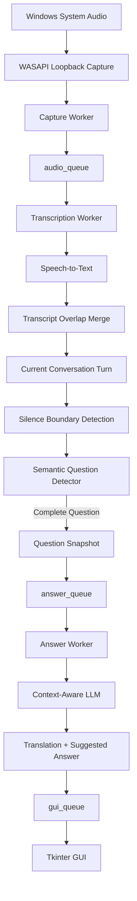

# Real-Time Q&A Assistant

[English](README.md) | [Lietuvių](README_LT.md)

A Windows desktop AI assistant that listens to spoken conversations, detects completed questions, and generates context-aware answer suggestions in near real time.

This repository presents the project as a technical portfolio case study. The complete implementation source code is maintained separately in a private repository.

## Overview

Real-Time Q&A Assistant combines system-audio capture, speech recognition, semantic question detection, LLM-based answer generation, asynchronous processing, and a lightweight desktop GUI.

The application captures Windows system audio, converts speech to text, determines when a complete question has been asked, and generates a suggested answer using additional user-provided context.

The system is not limited to job interviews. The same architecture can be adapted to different live spoken Q&A scenarios, including technical discussions, meetings, consultations, training sessions, demonstrations, and support conversations.

The current implementation is a working Windows prototype.

## Application Preview


## Core Capabilities

- Windows system-audio capture using WASAPI loopback
- Continuous chunk-based speech transcription
- Audio overlap between consecutive chunks
- Fuzzy transcript overlap removal
- RMS-based silence detection
- Semantic question-state detection using `YES / WAIT / NO`
- Multi-part spoken-question handling
- Context-aware answer generation
- Question translation and suggested-answer generation in a single LLM request
- Unique Question IDs for reliable question-answer mapping
- Question history with `Previous`, `Next`, and `Latest` navigation
- Background worker threads and queue-based communication
- Pure-silence STT skipping to reduce unnecessary API calls
- Bounded text context to control LLM input size
- Non-blocking GUI shutdown
- Single-instance protection on Windows

## High-Level Architecture



The application is intentionally divided into independent processing stages.

Audio capture, transcription, question detection, answer generation, and GUI updates can therefore operate without unnecessarily blocking one another.

A more detailed explanation is available in the [Architecture documentation](docs/architecture.md).

## Technology

The prototype currently uses:

- **Python** — primary implementation language
- **PyAudioWPatch** — Windows WASAPI loopback audio capture
- **WASAPI** — system-audio capture on Windows
- **OpenAI APIs** — speech-to-text and LLM processing
- **Tkinter** — desktop graphical interface
- **Python threading** — independent background workers
- **Python Queue** — communication between processing stages
- **Git / GitHub** — version control and portfolio documentation

The implementation focuses more on system behaviour and integration than on using a large application framework.

## Engineering Focus

Several engineering problems became central during development.

### Continuous Audio Processing

The application must continue capturing new audio while previous chunks are being transcribed or processed.

This led to a worker-based architecture rather than one sequential processing loop.

### Chunk Boundary Continuity

Speech may cross the boundary between two audio chunks.

Approximately one second of audio overlap is therefore preserved between consecutive chunks.

Because this creates repeated speech in consecutive STT results, transcript overlap removal is also required.

### Question Boundary Detection

Silence alone is not a reliable indication that a spoken question has ended.

The application therefore combines:

```text
confirmed silence
+
semantic question detection
```

A semantic detector classifies the accumulated conversation turn as:

```text
YES
WAIT
NO
```

This allows a speaker to pause naturally in the middle of a multi-part question without prematurely triggering answer generation.

### Asynchronous Answer Generation

Generating an answer may take longer than transcribing incoming audio.

A dedicated Answer Worker therefore processes completed questions independently, allowing the transcription pipeline to continue listening.

### Reliable Question Mapping

Answer generation is asynchronous, and the user can navigate through question history while processing continues.

Each completed question therefore receives a unique Question ID that remains attached to the question throughout the complete pipeline.

## Processing Pipeline

The primary processing flow is:

```text
Windows system audio
        ↓
WASAPI loopback capture
        ↓
audio chunk
        ↓
speech detection
        ↓
speech-to-text
        ↓
transcript overlap removal
        ↓
current conversation turn
        ↓
confirmed silence
        ↓
semantic question detection
        ↓
completed-question snapshot
        ↓
answer queue
        ↓
context-aware LLM
        ↓
question translation + suggested answer
        ↓
GUI history
```

A pure-silence audio chunk can skip the STT API call while still participating in question-boundary processing.

This distinction is important because a silent chunk may confirm that the speaker has finished talking.

## Question Detection

The application does not assume that every pause marks the end of a question.

For example:

```text
"Could you tell me about a project where..."
        ↓
pause
        ↓
"...you had to process a large amount of data?"
```

After the first pause, the semantic detector can return:

```text
WAIT
```

The conversation turn remains active.

After the speaker completes the question and another confirmed silence occurs, the detector can return:

```text
YES
```

Only then is the question frozen and sent for answer generation.

This combination of acoustic and semantic state was one of the key design decisions in the project.

## Conversation History

The GUI maintains a local history of completed questions.

Each history item is associated with its own Question ID and can contain:

```text
detected question
translated question
suggested answer
processing status
```

Navigation includes:

```text
Previous
Next
Latest
Question X / Y
```

If the user navigates to an older question, new questions can continue arriving without forcing the GUI to leave the currently viewed history item.

## Optimization and Stability

Optimization work focused on problems observed during real development and testing rather than on theoretical micro-optimization.

### API Context Control

An earlier development issue demonstrated that repeatedly sending growing text context to an LLM can produce unexpectedly high API usage.

The application therefore limits text independently for:

```text
semantic question detection
answer generation
active conversation turn
```

### Pure-Silence STT Skipping

Chunks containing no detected speech do not require transcription.

The application skips the STT request while preserving downstream question-boundary logic.

### Single-Instance Protection

Running multiple copies of the application can duplicate audio processing and API requests.

A Windows file lock prevents a second processing pipeline from starting accidentally.

### State Cleanup

Unused queue metadata, obsolete state, and development-only transcript accumulation were removed after the main pipeline became stable.

### Responsive Shutdown

Shutdown originally used blocking worker waits in the Tkinter thread.

The final version uses non-blocking worker-state checks so the GUI remains responsive while background processing finishes.

## Testing

Testing was performed throughout development at both component and full-pipeline level.

Testing included:

- Windows WASAPI loopback capture
- speech-to-text processing
- chunk-boundary behaviour
- transcript overlap removal
- silence detection
- semantic `YES / WAIT / NO` detection
- multi-part spoken questions
- Question ID mapping
- GUI history and navigation
- asynchronous answer generation
- pure-silence STT optimization
- single-instance protection
- shutdown behaviour
- end-to-end multi-question regression testing

GUI state behaviour was also tested independently using mock events.

The final regression scenario processed multiple spoken questions through the complete pipeline and confirmed correct question separation, answer generation, history behaviour, silence optimization, and clean shutdown.

See the full [Testing documentation](docs/testing.md).

## Development Evolution

The application was built incrementally rather than designed completely in advance.

The development path progressed roughly through:

```text
audio capture
→ speech-to-text
→ continuous processing
→ worker threads and queues
→ audio overlap
→ transcript merge
→ conversation-turn state
→ silence detection
→ semantic question detection
→ question snapshots
→ context-aware answer generation
→ GUI
→ question history
→ Question IDs
→ API-use safeguards
→ optimization
→ stability improvements
→ final regression testing
```

Many architectural decisions therefore came directly from problems discovered during implementation and real runtime testing.

A detailed chronological explanation is available in the [Development History](docs/development-history.md).

## Adaptability

The current prototype is not intended to be a fixed one-size-fits-all application.

Its modular architecture allows individual parts of the system to be changed according to the user or usage scenario.

Potentially configurable or replaceable areas include:

```text
user and scenario context
response language
response style
audio parameters
silence thresholds
question-detection behaviour
model selection
GUI presentation
workflow-specific logic
```

Future optimization and customization can therefore be based on real user requirements and practical feedback rather than adding functionality without a clear use case.

## Project Structure

The public portfolio repository is structured around project documentation rather than the complete implementation source code.

```text
realtime-qa-assistant/
│
├── README.md
├── README_LT.md
│
├── docs/
│   ├── architecture.md
│   ├── architecture_LT.md
│   ├── development-history.md
│   ├── development-history_LT.md
│   ├── testing.md
│   └── testing_LT.md
│
└── screenshots/
```

The Lithuanian technical-document versions are maintained separately from the English originals so each document can be read directly in the preferred language.

## Documentation

Detailed technical documentation:

| Document | English | Lietuvių |
|---|---|---|
| Architecture | [Open](docs/architecture.md) | [Atidaryti](docs/architecture_LT.md) |
| Development History | [Open](docs/development-history.md) | [Atidaryti](docs/development-history_LT.md) |
| Testing | [Open](docs/testing.md) | [Atidaryti](docs/testing_LT.md) |

The README files provide the project overview, while the documents above describe the implementation decisions, development process, and testing in greater detail.

## Source Code

The complete application implementation is maintained in a separate private Git repository.

The public repository intentionally focuses on:

```text
architecture
engineering decisions
development history
testing
project presentation
```

This allows the project to be presented as a technical portfolio case study without publishing the complete implementation.

A controlled standalone Windows demo package may be prepared as a later project stage so selected users can test the application without requiring the Python development environment.

## Current Status

The current Windows prototype has a working end-to-end pipeline for its primary use case.

Implemented and tested:

```text
system-audio capture
speech-to-text
continuous chunk processing
audio overlap
transcript merge
silence detection
semantic question detection
multi-part question handling
question snapshots
Question IDs
context-aware answer generation
question translation
asynchronous workers
GUI history
history navigation
API-use safeguards
single-instance protection
clean shutdown
```

Direct microphone capture has been tested separately but is intentionally not part of the primary application workflow at this stage.

Current work is focused on:

```text
portfolio documentation
public project presentation
future controlled distribution
user-driven customization
```

The project remains actively extensible, but new functionality is intended to be added when there is a clear practical requirement.