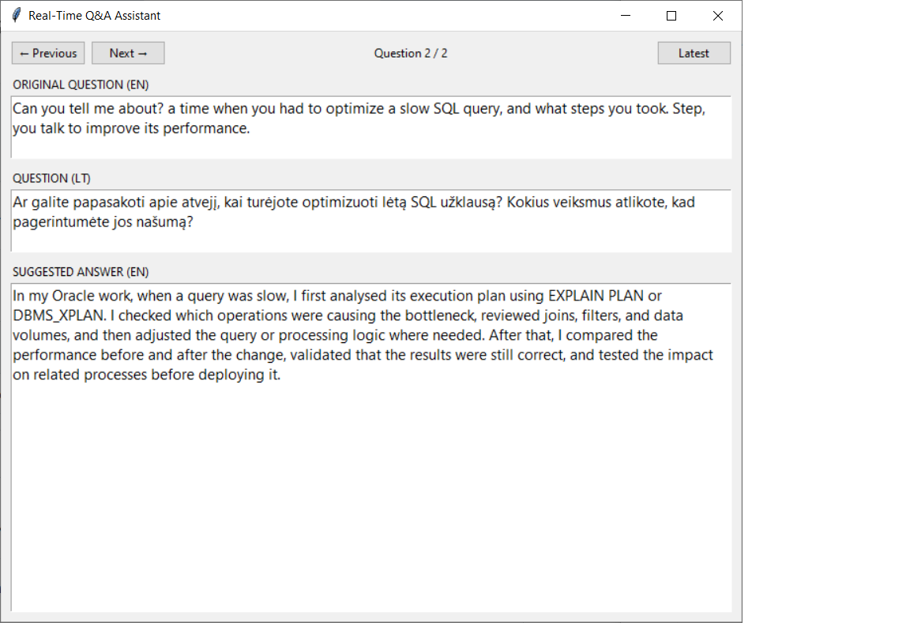
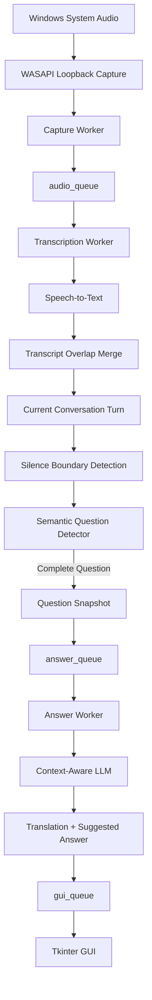

# Real-Time Q&A Assistant

[English](README.md) | [Lietuvių](README_LT.md)

Windows desktop AI asistentas, kuris klausosi žodinio pokalbio, atpažįsta užbaigtus klausimus ir beveik realiuoju laiku generuoja kontekstinius atsakymo pasiūlymus.

Šiame repository projektas pristatomas kaip techninis portfolio ir projekto analizė. Pilnas programos source code saugomas atskirame private repository.

## Apžvalga

Real-Time Q&A Assistant sujungia system audio capture, speech recognition, semantinį klausimo pabaigos nustatymą, LLM pagrįstą atsakymų generavimą, asynchronous processing ir lengvą desktop GUI.

Programa fiksuoja Windows sistemos garsą, paverčia kalbą tekstu, nustato, kada buvo užduotas pilnas klausimas, ir naudodama papildomą vartotojo pateiktą kontekstą sugeneruoja siūlomą atsakymą.

Sistema nėra skirta tik darbo pokalbiams. Ta pati architektūra gali būti pritaikoma ir kitiems live Q&A scenarijams: techninėms diskusijoms, susitikimams, konsultacijoms, mokymams, demonstracijoms ar support pokalbiams.

Dabartinė realizacija yra veikiantis Windows prototipas.

## Programos vaizdas



## Pagrindinės galimybės

- Windows system audio capture naudojant WASAPI loopback
- Nuolatinė chunk-based speech transcription
- Audio overlap tarp gretimų chunks
- Fuzzy transcript overlap pašalinimas
- RMS pagrįstas silence detection
- Semantinis klausimo būsenos nustatymas: `YES / WAIT / NO`
- Multi-part žodinių klausimų apdorojimas
- Context-aware atsakymų generavimas
- Klausimo vertimas ir siūlomo atsakymo generavimas vienu LLM request
- Unikalūs Question IDs patikimam klausimo ir atsakymo susiejimui
- Klausimų istorija su `Previous`, `Next` ir `Latest` navigacija
- Background worker threads ir queue pagrįsta komunikacija
- Pure-silence STT praleidimas mažinant nereikalingus API calls
- Ribojamas text context, kad būtų kontroliuojamas LLM input dydis
- GUI neblokuojantis shutdown
- Single-instance apsauga Windows aplinkoje

## Aukšto lygio architektūra



Programa sąmoningai padalinta į nepriklausomus processing etapus.

Todėl audio capture, transcription, question detection, answer generation ir GUI atnaujinimas gali vykti tarpusavyje be nereikalingo blokavimo.

Išsamesnis paaiškinimas pateiktas [architektūros dokumentacijoje](docs/architecture_LT.md).

## Technologijos

Dabartiniame prototipe naudojama:

- **Python** — pagrindinė programavimo kalba
- **PyAudioWPatch** — Windows WASAPI loopback audio capture
- **WASAPI** — Windows sistemos garso fiksavimas
- **OpenAI APIs** — speech-to-text ir LLM processing
- **Tkinter** — desktop grafinė sąsaja
- **Python threading** — nepriklausomi background workers
- **Python Queue** — duomenų perdavimas tarp processing etapų
- **Git / GitHub** — version control ir portfolio dokumentacija

Projekte didesnis dėmesys skiriamas sistemos veikimui, jos komponentų integracijai ir architektūriniams sprendimams, o ne didelio application framework naudojimui.

## Pagrindiniai inžineriniai uždaviniai

Kūrimo metu išryškėjo keli pagrindiniai techniniai uždaviniai.

### Nuolatinis audio apdorojimas

Programa turi ir toliau fiksuoti naują garsą tuo metu, kai ankstesni chunks jau transkribuojami arba kitaip apdorojami.

Todėl vietoje vieno nuoseklaus processing loop buvo pasirinkta worker pagrįsta architektūra.

### Tęstinumas tarp Audio Chunks

Kalba gali patekti ties dviejų audio chunks riba.

Todėl tarp gretimų chunks išlaikomas maždaug vienos sekundės audio overlap.

Kadangi dėl to tie patys žodžiai gali atsirasti dviejuose STT rezultatuose, reikalinga ir transcript overlap pašalinimo logika.

### Klausimo pabaigos nustatymas

Vien silence nėra patikimas požymis, kad žodinis klausimas jau baigtas.

Todėl programa derina:

```text
confirmed silence
+
semantic question detection
```

Semantic detector sukauptą conversation turn klasifikuoja kaip:

```text
YES
WAIT
NO
```

Tai leidžia žmogui natūraliai sustoti viduryje sudėtinio klausimo ir neinicijuoti answer generation per anksti.

### Asynchronous Answer Generation

Atsakymo generavimas gali trukti ilgiau nei naujo audio transkribavimas.

Todėl atskiras Answer Worker apdoroja užbaigtus klausimus nepriklausomai, o transcription pipeline tuo metu gali ir toliau klausytis naujo audio.

### Patikimas klausimo ir atsakymo susiejimas

Answer generation vyksta asynchronously, o vartotojas tuo metu gali naviguoti klausimų istorijoje.

Todėl kiekvienam completed question suteikiamas unikalus Question ID, kuris lieka susietas su tuo pačiu klausimu per visą pipeline.

## Processing Pipeline

Pagrindinė duomenų apdorojimo eiga:

```text
Windows system audio
        ↓
WASAPI loopback capture
        ↓
audio chunk
        ↓
speech detection
        ↓
speech-to-text
        ↓
transcript overlap removal
        ↓
current conversation turn
        ↓
confirmed silence
        ↓
semantic question detection
        ↓
completed-question snapshot
        ↓
answer queue
        ↓
context-aware LLM
        ↓
question translation + suggested answer
        ↓
GUI history
```

Pure-silence audio chunk gali praleisti STT API call, tačiau vis tiek dalyvauti question-boundary processing.

Tai svarbu, nes būtent tylus chunk gali patvirtinti, kad kalbantis žmogus jau baigė savo klausimą.

## Klausimo nustatymas

Programa nelaiko kiekvienos pauzės klausimo pabaiga.

Pavyzdžiui:

```text
"Could you tell me about a project where..."
        ↓
pause
        ↓
"...you had to process a large amount of data?"
```

Po pirmos pauzės semantic detector gali grąžinti:

```text
WAIT
```

Tas pats conversation turn išlieka aktyvus.

Kai žmogus užbaigia klausimą ir vėl nustatoma confirmed silence, detector gali grąžinti:

```text
YES
```

Tik tada klausimas užfiksuojamas ir perduodamas answer generation.

Akustinės ir semantinės būsenos derinimas tapo vienu svarbiausių šio projekto architektūrinių sprendimų.

## Klausimų istorija

GUI saugo completed questions istoriją.

Kiekvienas istorijos įrašas susietas su savo Question ID ir gali turėti:

```text
detected question
translated question
suggested answer
processing status
```

Navigacija:

```text
Previous
Next
Latest
Question X / Y
```

Jeigu vartotojas peržiūri senesnį klausimą, nauji klausimai gali ir toliau būti priimami, tačiau GUI nepriverčia vartotojo palikti tuo metu peržiūrimo istorijos įrašo.

## Optimizavimas ir stabilumas

Optimization buvo atliekamas pagal realiai development ir testing metu pastebėtas problemas, o ne vien dėl teorinės galimybės dar kažką optimizuoti.

### API Context Control

Vienas ankstesnis development incidentas parodė, kad pakartotinai siunčiant vis didėjantį text context į LLM galima netikėtai stipriai padidinti API usage.

Todėl programa atskirai riboja tekstą:

```text
semantic question detection
answer generation
active conversation turn
```

### Pure-Silence STT Skipping

Chunks, kuriuose neaptinkama speech, nereikia transkribuoti.

Programa praleidžia STT request, tačiau išsaugo tolesnę question-boundary logiką.

### Single-Instance Protection

Kelios vienu metu paleistos programos kopijos galėtų dubliuoti audio processing ir API requests.

Windows file lock neleidžia netyčia paleisti antro processing pipeline.

### State Cleanup

Kai pagrindinis pipeline tapo stabilus, buvo pašalintas nebenaudojamas queue metadata, pasenęs state ir tik development metu reikalingas nuolat augantis full transcript.

### Responsive Shutdown

Pradinė shutdown versija naudojo blocking worker laukimą Tkinter thread.

Galutinėje versijoje worker būsena tikrinama neblokuojant GUI, todėl interface išlieka responsive ir programos uždarymo metu.

## Testavimas

Testing buvo atliekamas viso projekto kūrimo metu tiek atskirų komponentų, tiek viso pipeline lygiu.

Buvo tikrinama:

- Windows WASAPI loopback audio capture
- speech-to-text processing
- chunk boundary elgsena
- transcript overlap pašalinimas
- silence detection
- semantic `YES / WAIT / NO` detection
- multi-part spoken questions
- Question ID mapping
- GUI history ir navigacija
- asynchronous answer generation
- pure-silence STT optimization
- single-instance protection
- shutdown elgsena
- end-to-end kelių klausimų regression testing

GUI state logika taip pat buvo tikrinama atskirai naudojant mock events.

Final regression scenarijus perleido kelis žodžiu pateiktus klausimus per visą pipeline ir patvirtino teisingą klausimų atskyrimą, answer generation, history veikimą, silence optimization ir švarų shutdown.

Išsamiau — [Testing dokumentacijoje](docs/testing_LT.md).

## Projekto kūrimo evoliucija

Programa buvo kuriama palaipsniui, o ne iš anksto iki galo suprojektuojant visą architektūrą.

Pagrindinė development eiga buvo maždaug tokia:

```text
audio capture
→ speech-to-text
→ continuous processing
→ worker threads and queues
→ audio overlap
→ transcript merge
→ conversation-turn state
→ silence detection
→ semantic question detection
→ question snapshots
→ context-aware answer generation
→ GUI
→ question history
→ Question IDs
→ API-use safeguards
→ optimization
→ stability improvements
→ final regression testing
```

Daugelis architektūrinių sprendimų atsirado tiesiogiai iš problemų, pastebėtų implementation ir realių runtime testų metu.

Detali chronologinė projekto eiga pateikta [Development History dokumente](docs/development-history_LT.md).

## Pritaikomumas

Dabartinis prototipas nėra kuriamas kaip nekintanti „viena programa visiems“.

Modulinė architektūra leidžia atskiras sistemos dalis keisti pagal konkretų vartotoją arba naudojimo scenarijų.

Gali būti keičiami arba konfigūruojami, pavyzdžiui:

```text
user and scenario context
response language
response style
audio parameters
silence thresholds
question-detection behaviour
model selection
GUI presentation
workflow-specific logic
```

Todėl tolimesnis optimization ir customization gali būti grindžiamas realiais vartotojų poreikiais ir praktiniu feedback, o ne funkcijų pridėjimu vien todėl, kad techniškai jas galima pridėti.

## Projekto struktūra

Public portfolio repository skirtas projekto dokumentacijai, o ne pilnam implementation source code.

```text
realtime-qa-assistant/
│
├── README.md
├── README_LT.md
│
├── docs/
│   ├── architecture.md
│   ├── architecture_LT.md
│   ├── development-history.md
│   ├── development-history_LT.md
│   ├── testing.md
│   └── testing_LT.md
│
└── screenshots/
```

Lietuviškos techninių dokumentų versijos laikomos atskirai nuo English originalų, kad kiekvieną dokumentą būtų galima tiesiogiai perskaityti pasirinkta kalba.

## Dokumentacija

Išsami techninė dokumentacija:

| Dokumentas | English | Lietuvių |
|---|---|---|
| Architecture | [Open](docs/architecture.md) | [Atidaryti](docs/architecture_LT.md) |
| Development History | [Open](docs/development-history.md) | [Atidaryti](docs/development-history_LT.md) |
| Testing | [Open](docs/testing.md) | [Atidaryti](docs/testing_LT.md) |

README pateikia bendrą projekto vaizdą, o šiuose dokumentuose detaliau aprašyti implementation sprendimai, development procesas ir testing.

## Source Code

Pilna programos realizacija saugoma atskirame private Git repository.

Public repository sąmoningai koncentruojasi į:

```text
architecture
engineering decisions
development history
testing
project presentation
```

Taip projektą galima pristatyti kaip techninį portfolio, viešai neskelbiant viso implementation.

Vėlesniame projekto etape gali būti parengtas controlled standalone Windows demo package, kad pasirinkti vartotojai galėtų patestuoti programą neturėdami Python development environment.

## Dabartinė būsena

Dabartinis Windows prototipas turi veikiantį end-to-end pipeline pagrindiniam naudojimo scenarijui.

Įgyvendinta ir ištestuota:

```text
system-audio capture
speech-to-text
continuous chunk processing
audio overlap
transcript merge
silence detection
semantic question detection
multi-part question handling
question snapshots
Question IDs
context-aware answer generation
question translation
asynchronous workers
GUI history
history navigation
API-use safeguards
single-instance protection
clean shutdown
```

Tiesioginis microphone capture buvo ištestuotas atskirai, tačiau šiame etape sąmoningai nėra pagrindinio application workflow dalis.

Šiuo metu darbas koncentruojamas į:

```text
portfolio documentation
public project presentation
future controlled distribution
user-driven customization
```

Projektas išlieka plečiamas, tačiau naują funkcionalumą numatoma pridėti tada, kai jam yra aiškus praktinis poreikis.