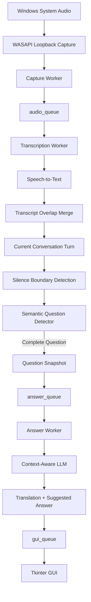

# Architecture

[English](architecture.md) | [Lietuvių](architecture_LT.md)  
[README (EN)](../README.md) | [README (LT)](../README_LT.md)

## Purpose

This document describes the internal architecture of the Real-Time Q&A Assistant.

The public repository does not contain the full implementation source code, but this document explains how the main components interact, how data moves through the system, and why the application was structured this way.

## High-Level Architecture



The application is built around several independent processing stages connected by queues.

This separation allows audio capture, transcription, question detection, answer generation, and GUI updates to operate without unnecessarily blocking one another.

## Main Components

The private implementation is divided into several modules, each with a clearly defined responsibility.

### Application Lifecycle

The main application layer is responsible for:

- initializing application-wide resources;
- loading user and contextual data;
- creating queues and synchronization events;
- initializing audio capture;
- creating the GUI;
- creating and starting worker threads;
- coordinating shutdown;
- preventing multiple application instances from running simultaneously.

Business logic is intentionally kept outside the main application entry point.

### Audio Layer

The audio layer is responsible for:

- initializing Windows WASAPI loopback;
- selecting the default system-audio loopback device;
- configuring channels, sample rate, and audio format;
- calculating RMS audio level;
- tracking silence duration;
- creating in-memory WAV buffers for speech-to-text processing.

The application captures Windows system audio rather than directly recording the microphone.

This means that audio played through the user's speakers or headphones can be processed by the application.

## Audio Capture Worker

The capture worker continuously reads audio from the WASAPI loopback stream.

Audio is divided into chunks rather than processed as one continuous recording.

Each queued audio item contains the data required by the transcription stage:

```text
chunk number
audio frames including overlap
speech detected flag
confirmed-silence boundary flag
```

A small portion of the previous audio chunk is preserved and prepended to the next one.

This overlap helps reduce the risk of losing words that occur near chunk boundaries.

## Audio Overlap

Chunk-based transcription introduces a practical problem.

A word or phrase near the boundary between two chunks may appear in both speech-to-text results.

For this reason, the system uses approximately one second of audio overlap between consecutive chunks.

Example:

```text
Chunk 1:
"...how did you process the large amount of data"

Chunk 2:
"the large amount of data and how did you validate it"
```

Without overlap handling, the combined transcript could contain duplicated text.

The transcription layer therefore compares the end of the previous transcript with the beginning of the new one and removes matching content.

## Transcription Worker

The transcription worker receives audio chunks from `audio_queue`.

Its main responsibilities are:

- deciding whether speech-to-text is required;
- sending speech-containing chunks to the STT API;
- skipping pure-silence chunks;
- merging overlapping transcript fragments;
- maintaining the current conversation turn;
- triggering semantic question detection after confirmed silence;
- creating completed-question snapshots;
- forwarding completed questions to the answer worker and GUI.

The worker does not maintain an unlimited full-session transcript.

Only the active conversation turn is required for question detection.

## Pure-Silence STT Skipping

Each new audio chunk is monitored using RMS volume.

If no speech is detected in the newly captured audio:

```text
speech_detected = false
```

the speech-to-text API call is skipped.

This reduces unnecessary API usage during quiet periods.

Importantly, the processing cycle itself is not skipped.

A silent chunk may still represent the moment when the configured silence duration becomes long enough to confirm that the speaker has stopped talking.

The system can therefore skip STT while still allowing question detection to run using already accumulated text.

## Current Conversation Turn

The system maintains a `current_turn` representing the active portion of the speaker's conversation.

New transcript fragments are appended to this turn until the system determines that a complete question has been asked.

The active turn is size-limited to prevent uncontrolled context growth during long sessions.

After a completed question is detected, the next conversation turn is not immediately reset during silence.

Instead, the reset occurs only when actual new speech produces new text.

This prevents silence-only chunks from accidentally creating empty conversation turns.

## Question Boundary Detection

Question detection uses two complementary mechanisms:

```text
Audio silence detection
+
Semantic question-state detection
```

Silence detection answers:

> Has the speaker stopped talking long enough to justify checking the text?

Semantic detection answers:

> Does the accumulated text represent a completed question?

This approach is more reliable than relying only on punctuation or silence.

## Silence Detection

The audio layer monitors RMS volume.

When the signal remains below the configured threshold, a silence period begins.

If silence continues for the configured confirmation duration, the system produces a confirmed silence boundary.

The boundary is generated only once for each continuous silence period.

When speech resumes, the silence state is reset.

## Semantic Question States

After a confirmed silence boundary, the accumulated conversation turn is evaluated semantically.

The detector returns one of three states:

```text
YES  - the question is complete
WAIT - the speaker is probably continuing
NO   - the current speech is not a completed question
```

Example:

```text
Speaker:
"Could you tell me about a project where you processed a large amount of data?"

→ possible completed question
```

But:

```text
Speaker:
"Could you tell me about a project where you processed a large amount of data,
and how you made sure..."

→ WAIT
```

The `WAIT` state allows multi-part questions to remain part of the same conversation turn.

## Completed Question Snapshot

When the semantic detector returns `YES`, the current conversation turn is frozen as a completed-question snapshot.

The snapshot is used independently of later incoming audio.

This prevents subsequent speech from changing a question that has already been recognized.

Each completed question receives a unique numeric ID.

Example:

```text
Question 1
Question 2
Question 3
...
```

## Question IDs

Question IDs are an important part of the state model.

Answer generation is asynchronous.

It is therefore possible for the user to navigate through previous questions while a newer answer is still being generated.

A unique question ID allows the system to reliably associate:

```text
detected question
translation
generated answer
GUI history entry
```

This avoids relying on display order or timing.

## Answer Queue

Completed questions are sent to `answer_queue`.

The queued item contains:

```text
question_id
question_text
```

This creates a clean boundary between question detection and answer generation.

The transcription worker can continue processing new audio without waiting for the answer to be produced.

## Answer Worker

The answer worker receives completed questions independently from the transcription process.

Its responsibilities include:

- using candidate or user context;
- using scenario or job context;
- generating a natural translation of the question;
- generating a concise suggested answer;
- parsing the structured model response;
- sending the result to the GUI together with the original question ID.

Translation and answer generation are intentionally combined into a single LLM request.

This reduces unnecessary API calls and avoids repeating the same question context in separate requests.

## Context-Aware Generation

The generated answer is not based only on the detected question.

The application can also use external contextual information.

Examples include:

```text
user profile
professional experience
technical skills
project background
target role or scenario context
```

This allows the same real-time processing pipeline to be adapted to different users and different Q&A situations.

The model is instructed not to invent unsupported experience or facts.

## GUI Communication

Background workers do not directly modify Tkinter widgets.

Instead, GUI updates are sent through `gui_queue`.

Typical events include:

```text
question_started
answer_ready
```

The Tkinter main thread periodically processes these events and updates the interface.

This avoids unsafe direct GUI access from background threads.

## Conversation History

The GUI keeps a local history of completed questions.

Each history entry contains:

```text
question_id
detected question
translated question
suggested answer
processing status
```

The interface provides:

```text
Previous
Next
Latest
Question X / Y
```

A `follow_latest` state determines whether the GUI automatically follows newly detected questions.

If the user navigates to an older question:

```text
follow_latest = false
```

new questions continue to be stored, but the currently viewed question remains visible.

Selecting `Latest` returns the interface to automatic latest-question tracking.

## Thread Model

The application uses three main background workers:

```text
Capture Worker
Transcription Worker
Answer Worker
```

Their roles are deliberately separated.

### Capture Worker

Responsible for:

```text
system audio
silence state
speech detection
audio overlap
```

### Transcription Worker

Responsible for:

```text
speech-to-text
transcript overlap removal
conversation-turn state
semantic question detection
question snapshot creation
```

### Answer Worker

Responsible for:

```text
context-aware LLM processing
question translation
suggested answer generation
```

The Tkinter GUI remains on the main application thread.

## Queue Model

The main queues are:

```text
audio_queue
answer_queue
gui_queue
```

Data flow:

```text
Capture Worker
    ↓
audio_queue
    ↓
Transcription Worker
    ↓
answer_queue
    ↓
Answer Worker

Transcription Worker ──→ gui_queue
Answer Worker ────────→ gui_queue
                         ↓
                       GUI
```

Queues reduce direct dependencies between workers and make the flow easier to control and debug.

## Shutdown Flow

Application shutdown is coordinated rather than immediately terminating all workers.

The normal shutdown sequence is:

```text
User closes GUI
        ↓
stop_event is set
        ↓
audio stream is stopped
        ↓
Capture Worker finishes
        ↓
Transcription Worker processes remaining queued audio
        ↓
Answer Worker processes remaining questions
        ↓
audio resources are released
        ↓
GUI is destroyed
```

Tkinter does not wait for workers using long blocking `join()` calls.

Instead, the application periodically checks worker state using the GUI event loop.

This keeps the interface responsive while shutdown is in progress.

## Single-Instance Protection

The application uses a Windows file lock to prevent multiple copies of the program from running at the same time.

This protection was introduced after practical testing showed that accidentally running multiple instances could cause duplicated audio processing and unnecessary API usage.

The lock exists only while the application process is running.

## Context Size Control

Several text inputs are explicitly size-limited.

This prevents long-running sessions from continuously increasing the amount of text sent to the LLM.

The limits apply independently to:

```text
semantic question detection
answer generation
active conversation turn
```

This improves cost predictability and reduces the risk of runaway context growth.

## Architectural Principles

The architecture developed around several practical principles:

### Separate Responsibilities

Audio, transcription, LLM processing, GUI logic, and lifecycle management are separated into dedicated modules.

### Avoid Blocking the Audio Pipeline

Answer generation should not prevent the system from continuing to capture and transcribe incoming audio.

### Preserve Question State

A multi-part spoken question must remain one logical conversation turn until semantic detection confirms completion.

### Minimize Unnecessary API Usage

Pure silence, duplicated processing, and uncontrolled text growth should not create avoidable API requests or token usage.

### Keep the GUI Responsive

Background processing and shutdown should not block the Tkinter main thread.

### Prefer Explicit State

Question IDs, conversation-turn state, silence state, and GUI history state are maintained explicitly rather than inferred indirectly from timing.

## Adaptability

The architecture is intentionally modular.

Different parts of the system can be adjusted independently according to the intended user or usage scenario.

Examples include:

```text
audio parameters
silence thresholds
question-detection behaviour
context sources
response language
response style
GUI presentation
model selection
workflow-specific logic
```

The current architecture therefore represents a working baseline rather than a fixed final configuration.

Further changes can be driven by practical user feedback and real usage conditions.

## Summary

The Real-Time Q&A Assistant is structured as an asynchronous processing pipeline rather than as a single sequential script.

The main architectural flow is:

```text
capture
→ transcribe
→ merge
→ accumulate
→ detect
→ snapshot
→ generate
→ display
```

The separation of responsibilities, explicit state handling, queue-based communication, and API-use controls allow the prototype to remain responsive while processing live spoken Q&A in near real time.