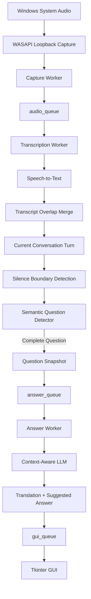

# Architektūra

[English](architecture.md) | [Lietuvių](architecture_LT.md)  
[README (EN)](../README.md) | [README (LT)](../README_LT.md)

## Paskirtis

Šiame dokumente aprašoma vidinė Real-Time Q&A Assistant architektūra.

Viešame repository nėra pilno implementation source code, tačiau šiame dokumente paaiškinama, kaip sąveikauja pagrindiniai komponentai, kaip duomenys juda per sistemą ir kodėl programa buvo suprojektuota būtent taip.

## Aukšto lygio architektūra



Programa sudaryta iš kelių nepriklausomų processing etapų, tarpusavyje sujungtų per queues.

Toks atskyrimas leidžia audio capture, transcription, question detection, answer generation ir GUI atnaujinimams veikti neblokuojant vieniems kitų be reikalo.

## Pagrindiniai komponentai

Privati implementation dalis suskirstyta į kelis modulius, kurių kiekvienas turi aiškiai apibrėžtą atsakomybę.

### Programos gyvavimo ciklas

Pagrindinis programos sluoksnis atsakingas už:

- visai programai reikalingų resursų inicializavimą;
- vartotojo ir kontekstinių duomenų įkėlimą;
- queues ir synchronization events sukūrimą;
- audio capture inicializavimą;
- GUI sukūrimą;
- worker threads sukūrimą ir paleidimą;
- shutdown koordinavimą;
- apsaugą nuo kelių programos instancijų paleidimo vienu metu.

Business logic sąmoningai laikoma atskirai nuo pagrindinio application entry point.

### Audio sluoksnis

Audio sluoksnis atsakingas už:

- Windows WASAPI loopback inicializavimą;
- default system-audio loopback device pasirinkimą;
- channels, sample rate ir audio format konfigūravimą;
- RMS audio level skaičiavimą;
- silence duration sekimą;
- in-memory WAV buffers kūrimą speech-to-text apdorojimui.

Programa fiksuoja Windows system audio, o ne tiesiogiai įrašinėja mikrofoną.

Tai reiškia, kad programa gali apdoroti garsą, leidžiamą per vartotojo speakers arba headphones.

## Audio Capture Worker

Capture Worker nuolat skaito audio iš WASAPI loopback stream.

Audio skaidomas į chunks, o ne apdorojamas kaip vienas nenutrūkstamas įrašas.

Kiekviename į queue perduodamame audio elemente yra transcription etapui reikalinga informacija:

```text
chunk number
audio frames including overlap
speech detected flag
confirmed-silence boundary flag
```

Nedidelė ankstesnio audio chunk dalis išsaugoma ir pridedama prie kito chunk pradžios.

Šis overlap sumažina riziką prarasti žodžius, kurie patenka ties chunk riba.

## Audio overlap

Chunk-based transcription sukuria praktinę problemą.

Žodis arba frazė, esanti ties dviejų chunks riba, gali patekti į abu speech-to-text rezultatus.

Todėl sistema naudoja maždaug vienos sekundės audio overlap tarp gretimų chunks.

Pavyzdys:

```text
Chunk 1:
"...how did you process the large amount of data"

Chunk 2:
"the large amount of data and how did you validate it"
```

Be overlap apdorojimo bendrame transcript atsirastų dubliuotas tekstas.

Todėl transcription sluoksnis palygina ankstesnio transcript pabaigą su naujo transcript pradžia ir pašalina sutampantį turinį.

## Transcription Worker

Transcription Worker gauna audio chunks iš `audio_queue`.

Pagrindinės jo atsakomybės:

- nuspręsti, ar reikalingas speech-to-text;
- siųsti speech turinčius chunks į STT API;
- praleisti pure-silence chunks;
- sujungti persidengiančius transcript fragmentus;
- palaikyti current conversation turn;
- po confirmed silence inicijuoti semantic question detection;
- kurti completed-question snapshots;
- perduoti užbaigtus klausimus Answer Worker ir GUI.

Worker nesaugo neribotai augančio visos sesijos transcript.

Question detection reikalingas tik aktyvus conversation turn.

## Pure-silence STT praleidimas

Kiekvienas naujas audio chunk stebimas pagal RMS volume.

Jeigu naujai užfiksuotame audio neaptinkama speech:

```text
speech_detected = false
```

speech-to-text API call praleidžiamas.

Tai sumažina nereikalingą API usage tylos metu.

Svarbu tai, kad pats processing cycle nėra praleidžiamas.

Silent chunk vis tiek gali būti tas momentas, kai nustatyta silence duration tampa pakankama patvirtinti, kad kalbantis žmogus nustojo kalbėti.

Todėl sistema gali praleisti STT, bet vis tiek vykdyti question detection naudodama jau sukauptą tekstą.

## Current Conversation Turn

Sistema palaiko `current_turn`, kuris reprezentuoja aktyvią kalbančio žmogaus pokalbio dalį.

Nauji transcript fragmentai pridedami prie šio turn tol, kol sistema nustato, kad buvo užduotas pilnas klausimas.

Aktyvaus turn dydis ribojamas, kad ilgų sesijų metu context neaugtų nekontroliuojamai.

Kai aptinkamas completed question, kitas conversation turn nėra iš karto resetinamas tylos metu.

Reset įvyksta tik tada, kai realiai atsiranda naujas speech ir naujas tekstas.

Tai neleidžia silence-only chunks netyčia kurti tuščių conversation turns.

## Klausimo ribos nustatymas

Question detection naudoja du vienas kitą papildančius mechanizmus:

```text
Audio silence detection
+
Semantic question-state detection
```

Silence detection atsako į klausimą:

> Ar kalbantis žmogus nustojo kalbėti pakankamai ilgai, kad jau būtų prasminga tikrinti tekstą?

Semantic detection atsako:

> Ar sukauptas tekstas yra užbaigtas klausimas?

Šis metodas patikimesnis nei pasikliauti vien punctuation arba silence.

## Silence detection

Audio sluoksnis stebi RMS volume.

Kai signalas lieka žemiau configured threshold, prasideda silence period.

Jeigu silence tęsiasi ilgiau nei nustatyta confirmation duration, sistema suformuoja confirmed silence boundary.

Boundary generuojamas tik vieną kartą kiekvienam nepertraukiamam silence period.

Kai speech atsinaujina, silence state resetinamas.

## Semantinės klausimo būsenos

Po confirmed silence boundary sukauptas conversation turn įvertinamas semantiškai.

Detector grąžina vieną iš trijų states:

```text
YES  - the question is complete
WAIT - the speaker is probably continuing
NO   - the current speech is not a completed question
```

Pavyzdys:

```text
Speaker:
"Could you tell me about a project where you processed a large amount of data?"

→ possible completed question
```

Tačiau:

```text
Speaker:
"Could you tell me about a project where you processed a large amount of data,
and how you made sure..."

→ WAIT
```

`WAIT` state leidžia multi-part questions išlaikyti kaip vieną conversation turn.

## Užbaigto klausimo snapshot

Kai semantic detector grąžina `YES`, esamas conversation turn užfiksuojamas kaip completed-question snapshot.

Šis snapshot vėliau naudojamas nepriklausomai nuo naujai gaunamo audio.

Taip vėliau pasirodantis speech nebegali pakeisti jau atpažinto klausimo.

Kiekvienam completed question suteikiamas unikalus numeric ID.

Pavyzdys:

```text
Question 1
Question 2
Question 3
...
```

## Question IDs

Question IDs yra svarbi state model dalis.

Answer generation vyksta asynchronously.

Todėl vartotojas gali naviguoti tarp ankstesnių klausimų tuo metu, kai naujesnio klausimo answer dar tik generuojamas.

Unikalus Question ID leidžia patikimai susieti:

```text
detected question
translation
generated answer
GUI history entry
```

Taip nereikia pasikliauti display order arba timing.

## Answer Queue

Completed questions perduodami į `answer_queue`.

Queue elemente yra:

```text
question_id
question_text
```

Tai sukuria aiškią ribą tarp question detection ir answer generation.

Transcription Worker gali toliau apdoroti naują audio nelaukdamas, kol bus sugeneruotas answer.

## Answer Worker

Answer Worker gauna completed questions nepriklausomai nuo transcription proceso.

Jo atsakomybės:

- naudoti candidate arba user context;
- naudoti scenario arba job context;
- sugeneruoti natūralų klausimo vertimą;
- sugeneruoti trumpą suggested answer;
- išparsinti structured model response;
- perduoti rezultatą GUI kartu su originaliu Question ID.

Translation ir answer generation sąmoningai sujungti į vieną LLM request.

Tai sumažina nereikalingus API calls ir neleidžia to paties klausimo context kartoti atskirose užklausose.

## Kontekstinis generavimas

Sugeneruotas answer paremtas ne vien detected question.

Programa taip pat gali naudoti išorinę contextual information.

Pavyzdžiui:

```text
user profile
professional experience
technical skills
project background
target role or scenario context
```

Tai leidžia tą patį real-time processing pipeline pritaikyti skirtingiems vartotojams ir skirtingiems Q&A scenarijams.

Modeliui nurodoma neišgalvoti nepatvirtintos patirties arba faktų.

## GUI komunikacija

Background workers tiesiogiai nekeičia Tkinter widgets.

Vietoje to GUI updates siunčiami per `gui_queue`.

Tipiniai events:

```text
question_started
answer_ready
```

Tkinter main thread periodiškai apdoroja šiuos events ir atnaujina interface.

Taip išvengiama nesaugaus tiesioginio GUI keitimo iš background threads.

## Pokalbio istorija

GUI saugo lokalią completed questions istoriją.

Kiekviename history entry yra:

```text
question_id
detected question
translated question
suggested answer
processing status
```

Interface turi:

```text
Previous
Next
Latest
Question X / Y
```

`follow_latest` state nustato, ar GUI automatiškai seka naujausius detected questions.

Jeigu vartotojas pereina prie senesnio klausimo:

```text
follow_latest = false
```

nauji klausimai ir toliau išsaugomi, tačiau šiuo metu peržiūrimas klausimas lieka ekrane.

Pasirinkus `Latest`, interface grįžta į automatinį latest-question tracking.

## Thread model

Programa naudoja tris pagrindinius background workers:

```text
Capture Worker
Transcription Worker
Answer Worker
```

Jų atsakomybės sąmoningai atskirtos.

### Capture Worker

Atsakingas už:

```text
system audio
silence state
speech detection
audio overlap
```

### Transcription Worker

Atsakingas už:

```text
speech-to-text
transcript overlap removal
conversation-turn state
semantic question detection
question snapshot creation
```

### Answer Worker

Atsakingas už:

```text
context-aware LLM processing
question translation
suggested answer generation
```

Tkinter GUI lieka pagrindiniame application thread.

## Queue model

Pagrindinės queues:

```text
audio_queue
answer_queue
gui_queue
```

Data flow:

```text
Capture Worker
    ↓
audio_queue
    ↓
Transcription Worker
    ↓
answer_queue
    ↓
Answer Worker

Transcription Worker ──→ gui_queue
Answer Worker ────────→ gui_queue
                         ↓
                       GUI
```

Queues sumažina tiesiogines dependencies tarp workers ir padaro flow lengviau valdomą bei debug'inamą.

## Shutdown eiga

Application shutdown vykdomas koordinuotai, o ne tiesiog akimirksniu nutraukiant visus workers.

Normali shutdown seka:

```text
User closes GUI
        ↓
stop_event is set
        ↓
audio stream is stopped
        ↓
Capture Worker finishes
        ↓
Transcription Worker processes remaining queued audio
        ↓
Answer Worker processes remaining questions
        ↓
audio resources are released
        ↓
GUI is destroyed
```

Tkinter nelaukia workers naudodamas ilgus blocking `join()` calls.

Vietoje to programa periodiškai tikrina worker state per GUI event loop.

Dėl to interface išlieka responsive ir shutdown metu.

## Single-instance apsauga

Programa naudoja Windows file lock, kuris neleidžia vienu metu veikti kelioms programos kopijoms.

Ši apsauga buvo pridėta po praktinio testavimo, kai paaiškėjo, kad netyčia paleistos kelios instancijos gali dubliuoti audio processing ir nereikalingai didinti API usage.

Lock egzistuoja tik tol, kol veikia application process.

## Context dydžio kontrolė

Keli text inputs turi aiškiai nustatytus size limits.

Tai neleidžia ilgose sesijose nuolat didėti LLM siunčiamo teksto kiekiui.

Limitai taikomi atskirai:

```text
semantic question detection
answer generation
active conversation turn
```

Tai pagerina cost predictability ir sumažina uncontrolled context growth riziką.

## Architektūriniai principai

Architektūra buvo formuojama pagal kelis praktinius principus.

### Atsakomybių atskyrimas

Audio, transcription, LLM processing, GUI logic ir lifecycle management atskirti į specializuotus modulius.

### Neblokuoti audio pipeline

Answer generation neturi stabdyti naujo audio capture ir transcription.

### Išsaugoti klausimo state

Multi-part spoken question turi išlikti vienu loginiu conversation turn tol, kol semantic detection patvirtina jo pabaigą.

### Mažinti nereikalingą API usage

Pure silence, duplicated processing ir uncontrolled text growth neturi kurti nereikalingų API requests arba token usage.

### Išlaikyti GUI responsive

Background processing ir shutdown neturi blokuoti Tkinter main thread.

### Naudoti aiškiai apibrėžtą state

Question IDs, conversation-turn state, silence state ir GUI history state palaikomi explicit būdu, o ne netiesiogiai nustatomi pagal timing.

## Pritaikomumas

Architektūra sąmoningai sukurta modular.

Skirtingos sistemos dalys gali būti keičiamos nepriklausomai pagal konkretų vartotoją arba usage scenario.

Pavyzdžiui:

```text
audio parameters
silence thresholds
question-detection behaviour
context sources
response language
response style
GUI presentation
model selection
workflow-specific logic
```

Todėl dabartinė architektūra yra veikiantis baseline, o ne nekintanti galutinė konfigūracija.

Tolimesni pakeitimai gali būti daromi remiantis realiu user feedback ir real-world naudojimo sąlygomis.

## Santrauka

Real-Time Q&A Assistant sukurtas kaip asynchronous processing pipeline, o ne kaip vienas sequential script.

Pagrindinis architektūros flow:

```text
capture
→ transcribe
→ merge
→ accumulate
→ detect
→ snapshot
→ generate
→ display
```

Responsibilities separation, explicit state handling, queue-based communication ir API-use controls leidžia prototipui išlikti responsive ir beveik realiuoju laiku apdoroti live spoken Q&A.
